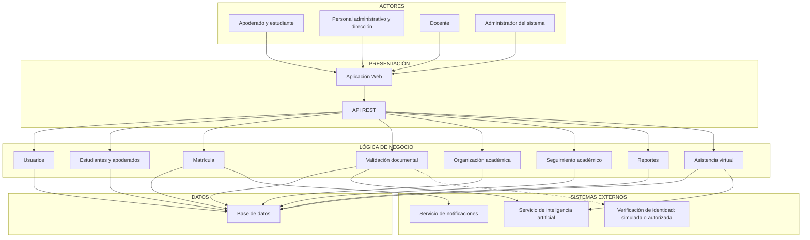

# Arquitectura inicial

## Arquitectura en tres capas

El sistema de matrícula y gestión académica se organizará utilizando una arquitectura de tres capas, separando las responsabilidades de presentación, lógica de negocio y acceso a datos.

### Capa de Presentación

Esta capa se encarga de la interacción entre el usuario y el sistema.

- Aplicación Web
- API REST

### Capa de Lógica de Negocio

Esta capa contiene las principales funcionalidades y reglas del sistema.

- Usuarios
- Estudiantes y apoderados
- Matrícula
- Validación documental
- Organización académica
- Seguimiento académico
- Reportes
- Asistencia virtual

### Capa de Datos

Esta capa se encarga del almacenamiento y consulta de la información.

- Base de datos

## Responsabilidades de las capas

| Capa | Pregunta que responde |
|---|---|
| Presentación | ¿Cómo interactúa el usuario? |
| Lógica de negocio | ¿Qué hace el sistema? |
| Datos | ¿Dónde se almacena la información? |

# Arquitectura inicial del sistema

## Diagrama de arquitectura

## Descripción

La arquitectura inicial se organiza en tres capas principales:

- **Presentación:** permite la interacción de los usuarios con el sistema mediante la aplicación web y la API REST.
- **Lógica de negocio:** contiene los módulos de usuarios, estudiantes y apoderados, matrícula, validación documental, organización académica, seguimiento académico, reportes y asistencia virtual.
- **Datos:** permite almacenar y consultar la información mediante una base de datos.

Además, los módulos de validación documental y asistencia virtual se integran con un servicio de inteligencia artificial. El módulo de matrícula utiliza un servicio de notificaciones.

La integración con un servicio de verificación de identidad es opcional y depende de contar con acceso autorizado; para el prototipo puede simularse. La línea discontinua representa esta integración pendiente.