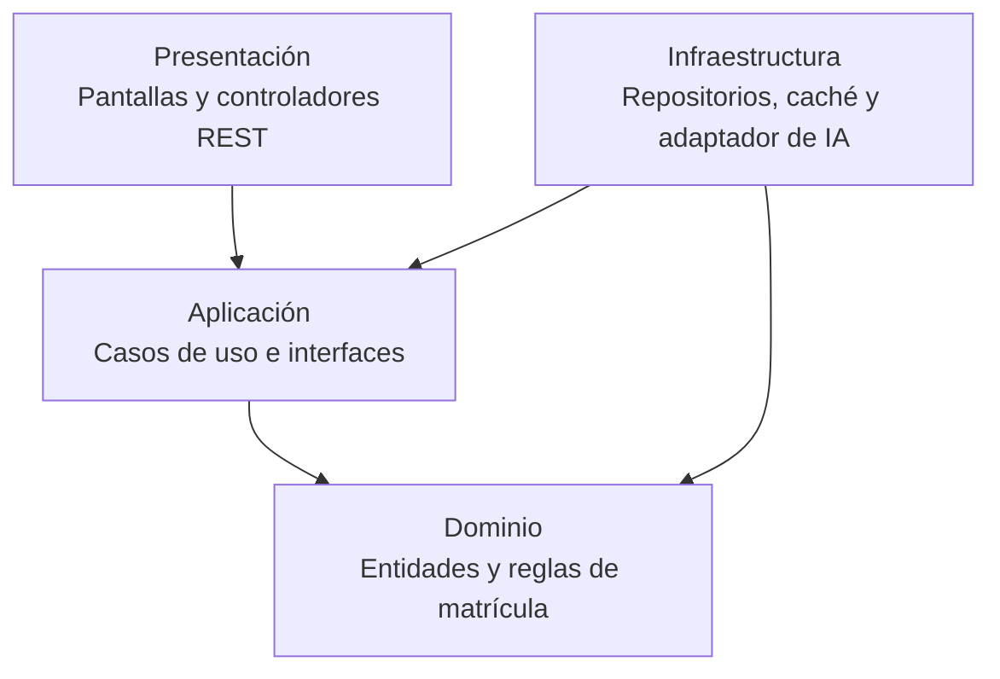

# Enfoque arquitectónico

## Clean Architecture

El Sistema de Matrícula y Gestión Académica utilizará Clean
Architecture para organizar las responsabilidades internas y
controlar las dependencias del código.

Este enfoque complementa el monolito modular definido en el paso
anterior y responde al driver DA08: mantenibilidad y evolución modular.

## Descripción del enfoque

| Elemento | Aplicación al sistema de matrícula |
|---|---|
| Patrón / enfoque arquitectónico | Clean Architecture (Arquitectura Limpia). |
| Objetivo | Separar responsabilidades y dirigir las dependencias hacia el núcleo del negocio. |
| Problema que resuelve | Evitar que las reglas de matrícula dependan directamente de la interfaz, la base de datos o el proveedor de IA. |
| Capas definidas | Dominio, Aplicación, Presentación e Infraestructura. |
| Beneficios | Facilitar el mantenimiento, las pruebas y el cambio de implementaciones técnicas. |

## Responsabilidades de las capas

### Dominio

Contiene las entidades y las reglas del negocio, independientes
de frameworks y servicios externos.

- Entidades: Estudiante, SolicitudMatricula, Matricula y Vacante.
- Reglas para cambiar el estado de una solicitud.
- Condiciones para confirmar una matrícula.
- Reglas sobre documentos requeridos y observaciones pendientes.

### Aplicación

Coordina los casos de uso y define los contratos necesarios para
acceder a datos y servicios externos.

- RegistrarSolicitud.
- AdjuntarDocumento.
- SubsanarObservaciones.
- RevisarDocumentacion.
- ConfirmarMatricula.
- ConsultarEstado.
- Interfaces de repositorios y del servicio de IA.

### Presentación

Recibe las solicitudes del usuario y presenta los resultados.

- Formularios y pantallas de la aplicación web.
- Controladores de la API REST.
- Validación del formato de los datos recibidos.
- Respuestas y mensajes para el usuario.

### Infraestructura

Implementa los contratos definidos en Aplicación utilizando
tecnologías concretas.

- Repositorios de base de datos.
- Almacenamiento de documentos.
- Adaptador del proveedor de IA.
- Implementación de caché.

## Regla de dependencias

Las dependencias del código apuntan hacia el núcleo del sistema:

- Dominio no depende de las demás capas.
- Aplicación depende de Dominio.
- Presentación utiliza los casos de uso de Aplicación.
- Infraestructura implementa las interfaces de Aplicación y puede
  utilizar las entidades de Dominio.
- Dominio y Aplicación no importan implementaciones de Infraestructura.

La configuración de arranque conecta los casos de uso con los
adaptadores concretos mediante inyección de dependencias.

## Diagrama de dependencias



Las flechas representan dependencias del código, no el orden
de ejecución de una solicitud.

## Ejemplo aplicado: confirmar matrícula

1. El controlador recibe la solicitud de confirmación.
2. El caso de uso ConfirmarMatricula coordina la operación.
3. Las reglas del Dominio permiten verificar si la solicitud cumple
   las condiciones de matrícula.
4. El caso de uso utiliza una interfaz para solicitar la confirmación
   y la asignación de la vacante.
5. El repositorio de Infraestructura ejecuta la operación en una
   transacción, verificando la disponibilidad y evitando duplicados.
6. Presentación devuelve el resultado al usuario.

El caso de uso conoce el contrato del repositorio, pero no depende
de una base de datos específica.

## Organización propuesta por módulo

Cada módulo puede organizar sus responsabilidades de esta manera:

```text
matricula/
├── dominio/
│   ├── entidades/
│   └── reglas/
├── aplicacion/
│   ├── casos-uso/
│   └── interfaces/
├── presentacion/
│   └── controladores/
└── infraestructura/
    └── repositorios/
```

Esta estructura es una propuesta de organización; en este laboratorio
no se requiere implementar nuevas funcionalidades.

## Justificación

Clean Architecture permite modificar las reglas de matrícula,
probar los casos de uso con implementaciones simuladas y sustituir
servicios técnicos sin afectar innecesariamente el núcleo del negocio.

Por ejemplo, cambiar el proveedor de IA requiere modificar su
adaptador de Infraestructura, manteniendo el contrato utilizado
por Aplicación.