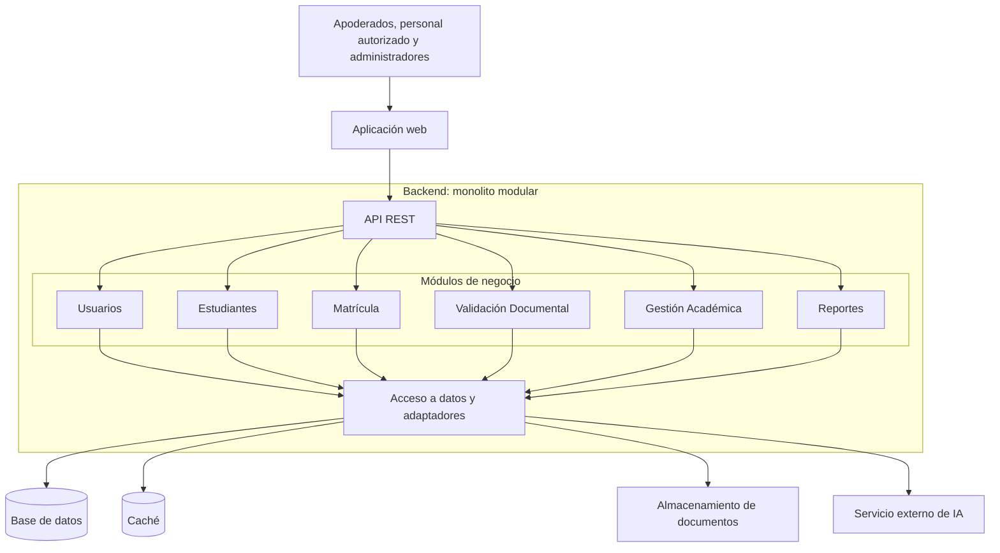

# Estilo arquitectónico

## Monolito modular organizado en capas

El Sistema de Matrícula y Gestión Académica utilizará un monolito
modular organizado en capas. El backend se desplegará como una sola
aplicación, con módulos que tendrán responsabilidades definidas.

La aplicación web se comunicará con el backend mediante una API REST.

## Justificación

Este estilo permite organizar las funcionalidades del sistema,
facilitar su mantenimiento y mantener un despliegue inicial sencillo.

Responde principalmente a los siguientes drivers:

- DA01: atender la concurrencia durante el periodo de matrícula.
- DA07: organizar la solución en capas y utilizar una API REST.
- DA08: facilitar cambios sin afectar innecesariamente otros módulos.

El backend podrá ejecutarse en varias instancias para aumentar su
capacidad. El cumplimiento de los 2000 usuarios concurrentes deberá
verificarse mediante pruebas de carga.

## Módulos del sistema

| Módulo | Responsabilidad |
|---|---|
| Usuarios | Gestionar cuentas, roles y permisos de acceso. |
| Estudiantes | Administrar información de estudiantes y apoderados. |
| Matrícula | Gestionar solicitudes, vacantes y confirmación de matrícula. |
| Validación Documental | Revisar documentos, registrar observaciones y coordinar la asistencia de IA. |
| Gestión Académica | Administrar grados, secciones, cursos y docentes. |
| Reportes | Generar consultas y estadísticas del proceso. |

Los módulos forman parte del mismo backend. Su separación es lógica
y no implica que se desplieguen como servicios independientes.

## Organización en capas

### Capa de Presentación

Permite la interacción con los usuarios y recibe sus solicitudes.

- Aplicación web.
- Controladores de la API REST.

### Capa de Lógica de Negocio

Contiene los casos de uso y las reglas del sistema.

- Registro y seguimiento de solicitudes.
- Validación documental.
- Confirmación de matrícula.
- Control de vacantes.
- Gestión académica.

### Capa de Acceso a Datos e Integraciones

Permite almacenar información y comunicarse con recursos externos.

- Repositorios de base de datos.
- Almacenamiento de documentos.
- Caché.
- Adaptador del servicio de IA.

## Componentes externos

| Componente | Función |
|---|---|
| Base de datos | Almacenar usuarios, estudiantes, solicitudes, matrículas y vacantes. |
| Caché | Reducir consultas repetitivas de información frecuente. |
| Almacenamiento de documentos | Conservar los archivos presentados y las constancias generadas. |
| Servicio de IA | Asistir en la revisión documental mediante un adaptador. |

## Diagrama de arquitectura

Las flechas representan comunicación entre componentes.
Los módulos comparten una misma unidad de despliegue del backend.

## Relación con Clean Architecture

El monolito modular define la estructura global del backend.
La organización en capas separa sus responsabilidades.

En el siguiente paso se aplicará Clean Architecture para precisar
las responsabilidades de Dominio, Aplicación, Presentación e
Infraestructura y controlar las dependencias internas.